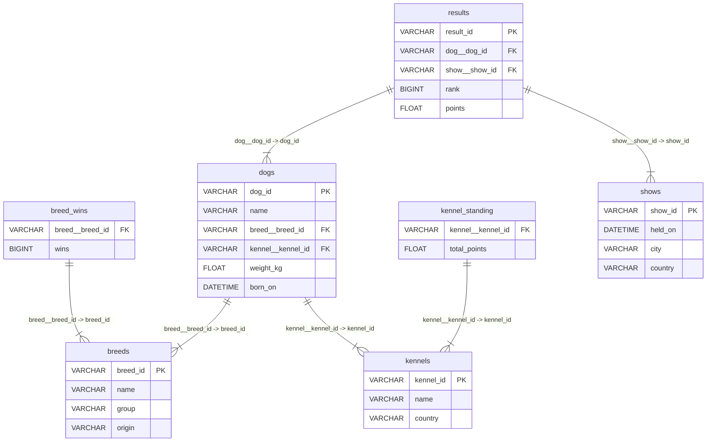

```mermaid
erDiagram
  "breed_wins" {    
    VARCHAR breed__breed_id FK     
    BIGINT wins  
  }
  "results" {    
    VARCHAR result_id PK     
    VARCHAR dog__dog_id FK     
    VARCHAR show__show_id FK     
    BIGINT rank      
    FLOAT points  
  }
  "dogs" {    
    VARCHAR dog_id PK     
    VARCHAR name      
    VARCHAR breed__breed_id FK     
    VARCHAR kennel__kennel_id FK     
    FLOAT weight_kg      
    DATETIME born_on  
  }
  "kennel_standing" {    
    VARCHAR kennel__kennel_id FK     
    FLOAT total_points  
  }
  "breeds" {    
    VARCHAR breed_id PK     
    VARCHAR name      
    VARCHAR group      
    VARCHAR origin  
  }
  "kennels" {    
    VARCHAR kennel_id PK     
    VARCHAR name      
    VARCHAR country  
  }
  "shows" {    
    VARCHAR show_id PK     
    DATETIME held_on      
    VARCHAR city      
    VARCHAR country  
  }
  "breed_wins" ||--|{ "breeds" : "breed__breed_id -> breed_id"
  "results" ||--|{ "dogs" : "dog__dog_id -> dog_id"
  "results" ||--|{ "shows" : "show__show_id -> show_id"
  "dogs" ||--|{ "breeds" : "breed__breed_id -> breed_id"
  "dogs" ||--|{ "kennels" : "kennel__kennel_id -> kennel_id"
  "kennel_standing" ||--|{ "kennels" : "kennel__kennel_id -> kennel_id"
```
